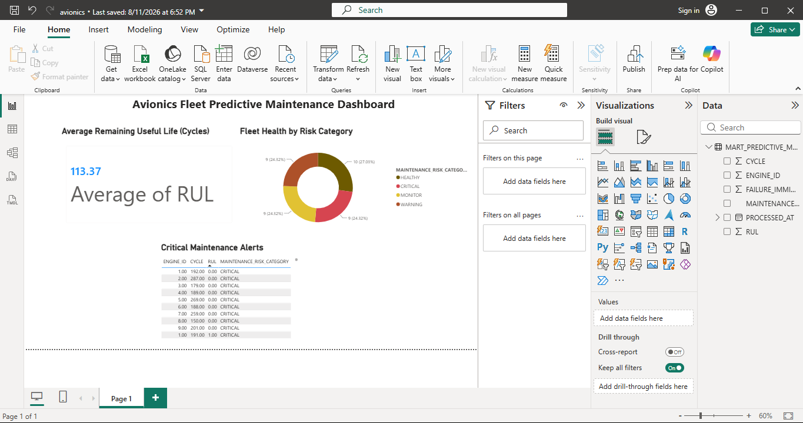

# Avionics Predictive Maintenance Analytics Platform

## Overview
An end-to-end Big Data pipeline for predictive maintenance of aircraft turbofan engines, built on NASA's real CMAPSS engine degradation dataset. The platform ingests and processes multi-sensor time-series data through **Apache Spark on Databricks**, transforms it through a layered **Snowflake** data warehouse using **dbt**, trains dual predictive models (failure classification and Remaining Useful Life regression) with **MLflow** experiment tracking, and delivers actionable insights through an interactive **Power BI** dashboard.

Built to demonstrate practical, hands-on experience with the Big Data and MLOps stack commonly used in industrial equipment health monitoring — directly applicable to aerospace, manufacturing, and technical support contexts.

---

## Architecture

```
NASA CMAPSS Dataset
        │
        ▼
Databricks (Unity Catalog Volume)
        │
        ▼
Apache Spark — Data Ingestion, Quality Checks, Feature Engineering (RUL calculation, rolling windows)
        │
        ▼
Snowflake — RAW schema
        │
        ▼
dbt — Staging & Mart models (transformation, risk categorisation)
        │
        ▼
Snowflake — Analytics schema
        │
        ├──────────────► Local Model Training (scikit-learn + MLflow tracking)
        │
        └──────────────► Power BI — Interactive Dashboard
```

---

## Technology Stack

| Layer | Technology | Purpose |
|-------|-----------|---------|
| Data Processing | Apache Spark (Databricks Community Edition) | Large-scale ingestion, data quality validation, feature engineering |
| Data Warehouse | Snowflake | Three-schema warehouse (RAW / STAGING / ANALYTICS) for structured sensor data |
| Transformation | dbt (data build tool) | Staging and mart models with automated data quality tests |
| Machine Learning | scikit-learn, MLflow | Model training, experiment tracking, metric logging |
| MLOps (partial) | Azure Machine Learning | Model registration workflow (see note below) |
| Visualisation | Power BI Desktop | Fleet health dashboard connected live to Snowflake |
| Version Control | Git, GitHub | Full commit history across all pipeline stages |

---

## Dataset

**NASA CMAPSS Turbofan Engine Degradation Simulation Dataset (FD001)**
- Source: NASA Prognostics Center of Excellence, via Kaggle
- 100 unique engines, 20,631 total sensor readings
- 21 sensor measurements per reading (temperature, pressure, speed, etc.) plus 3 operational settings
- Each engine runs from healthy operation to simulated failure — ideal for Remaining Useful Life (RUL) prediction

---

## Pipeline Details

### 1. Data Ingestion & Quality (Databricks + Spark)
Raw sensor data was ingested via PySpark, uncovering and resolving a real data quality issue: the source file's trailing delimiter spaces caused Spark to infer 2 extra empty columns. This was diagnosed by inspecting raw column output and fixed by explicitly selecting the first 26 columns before applying proper schema names. Post-fix validation confirmed **zero missing values and zero duplicate records** across all 20,631 rows.

### 2. Feature Engineering (Spark)
- Calculated **Remaining Useful Life (RUL)** per reading as `max_cycle − current_cycle` for each engine
- Built rolling 5-cycle window averages for all 21 sensors using Spark Window functions
- Flagged `failure_imminent` for readings within 30 cycles of engine failure

### 3. Data Warehouse (Snowflake)
A three-schema structure (RAW / STAGING / ANALYTICS) holds sensor data at increasing levels of refinement, loaded via Snowflake's native file upload from a feature-engineered sample exported from Databricks.

### 4. Transformation Layer (dbt)
- **Staging model** (`stg_engine_sensors`): cleans and selects relevant fields from raw data
- **Mart model** (`mart_predictive_maintenance`): categorises each reading into a maintenance risk tier (CRITICAL / WARNING / MONITOR / HEALTHY) based on RUL thresholds
- **Automated tests**: `not_null` constraints on key fields, verified passing

### 5. Model Training (scikit-learn + MLflow)
Two models trained locally with full MLflow experiment tracking:
- **Random Forest Classifier** — predicts imminent failure (binary)
- **Gradient Boosting Regressor** — predicts exact Remaining Useful Life (continuous)

### 6. Dashboard (Power BI)
Connected live to the Snowflake analytics mart, the dashboard presents:
- **Fleet Health by Risk Category** — donut chart of engine distribution across risk tiers
- **Average Remaining Useful Life** — fleet-wide key metric
- **Critical Maintenance Alerts** — sorted, actionable table of engines nearest failure

---

## Results



| Metric | Result |
|--------|--------|
| Classification Accuracy (failure imminent) | 96.5% |
| RUL Mean Absolute Error | 22.3 cycles |
| RUL R² Score | 0.838 |
| Total records processed | 20,631 |
| Data quality issues found & fixed | Trailing empty columns (Spark ingestion) |
| dbt tests passing | 2/2 |

These results are consistent with published benchmarks on the CMAPSS FD001 dataset, indicating a well-implemented pipeline rather than an artificially favourable train/test split.

---

## A Note On Scope And Honesty

This project was built independently using entirely free-tier tools (Databricks Community Edition, Snowflake trial, dbt Core, Power BI Desktop). Model training and MLflow experiment tracking were run **locally** rather than on Azure Machine Learning managed compute — an Azure account payment verification issue prevented completing the optional AzureML endpoint deployment step within this project's timeframe.

I'm familiar with the full registration and deployment workflow (model registration via the Azure ML SDK, managed online endpoints, MLflow-to-AzureML integration) and would be comfortable implementing it given a properly provisioned environment. I chose to keep the project honest about this constraint rather than represent partial work as complete — the core data engineering, transformation, and machine learning pipeline is fully functional and demonstrated end-to-end on real data.

---

## Project Structure

```
avionics-predictive-maintenance/
│
├── README.md
├── requirements.txt
├── .gitignore
├── .env.example
│
├── data/
│   └── avionics_sample.csv          # Feature-engineered sample (2,000 rows)
│
├── databricks/
│   ├── 01_data_ingestion.py         # Spark ingestion, trailing-column fix
│   ├── 02_data_quality.py           # Null/duplicate validation
│   └── 03_feature_engineering.py    # RUL calculation, rolling windows
│
├── snowflake/
│   ├── 01_setup_schemas.sql
│   └── 02_create_tables.sql
│
├── dbt/
│   └── avionics_dbt/
│       ├── dbt_project.yml
│       └── models/
│           ├── staging/
│           │   ├── stg_engine_sensors.sql
│           │   └── sources.yml
│           └── marts/
│               └── mart_predictive_maintenance.sql
│
├── azureml/
│   ├── 01_train_model.py            # Local training with MLflow tracking
│   └── 02_deploy_endpoint.py        # AzureML registration script (see note above)
│
└── dashboard/
    └── screenshots/
        └── power_bi_dashboard.png
```

---

## How To Run This Project

### Prerequisites
- Python 3.10+
- Databricks Community Edition account (free)
- Snowflake trial account (free, 30 days)
- dbt Core
- Power BI Desktop (Windows, free)

### Setup

```bash
git clone https://github.com/Kwaku-code/avionics-predictive-maintenance.git
cd avionics-predictive-maintenance
python -m venv venv
venv\Scripts\Activate.ps1
pip install -r requirements.txt
```

**1. Databricks:** Upload NASA CMAPSS data to a Unity Catalog Volume, run notebooks in `databricks/` in sequence (01 → 02 → 03).

**2. Snowflake:** Run `snowflake/01_setup_schemas.sql` then `02_create_tables.sql` in a Snowflake worksheet. Load the exported feature-engineered sample via Snowflake's file upload UI.

**3. dbt:**
```bash
cd dbt/avionics_dbt
dbt run
dbt test
```

**4. Model training:**
```bash
cd azureml
python 01_train_model.py
```

**5. Power BI:** Open Power BI Desktop → Get Data → Snowflake → connect using your account details → load `MART_PREDICTIVE_MAINTENANCE` → build/refresh visuals.

---

## Key Interview Talking Points

| Skill Area | Evidence |
|------------|----------|
| Apache Spark | Ingestion, window functions for rolling features, real bug diagnosis and fix |
| Databricks | Community Edition cluster, Unity Catalog volumes, notebook-based development |
| Snowflake | Multi-schema warehouse design, SQL DDL, file loading |
| dbt / ELT | Staging → mart architecture, source definitions, automated testing |
| MLflow | Experiment tracking, metric logging, model artifact management |
| Power BI | Live Snowflake connection, multi-visual dashboard design |
| Debugging & data quality | Diagnosed and resolved a real schema mismatch from trailing file delimiters |
| Professional honesty | Transparent documentation of what ran locally vs. cloud-native, and why |

---

## Author
**Kwaku Ampofo Agyapong**
Data Scientist | Machine Learning Engineer
📧 kwakuagyapong193@gmail.com
🔗 github.com/Kwaku-code

---

## License
MIT License — feel free to use and adapt this project
